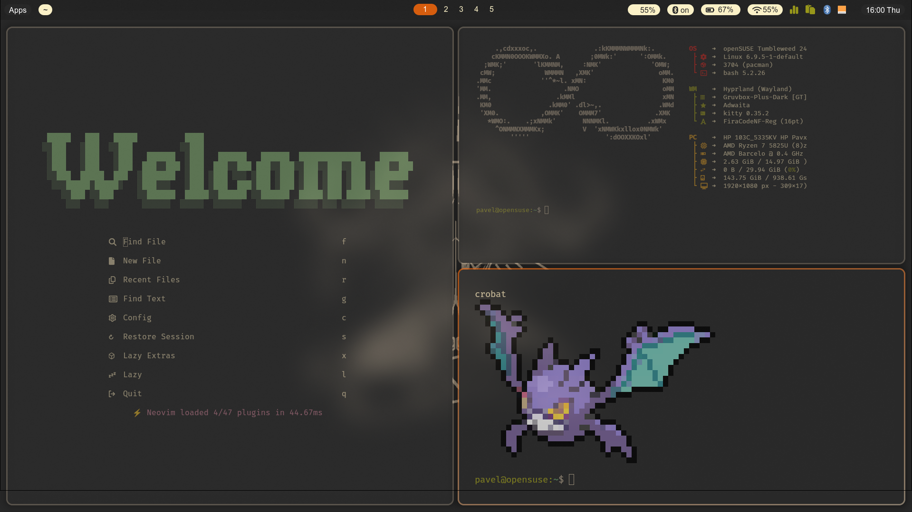

[//]: ###### (Documentation for me, when I need to install my system again. Pavel Hrdina)

<div align="center">
    <h1>Hyprland dotfiles</h1>
    <h3></h3>
</div>

<div align="center">
    
</div>

## Packages

> TODO: Add a list of packages that will be installed

## Installation

The script is made for openSUSE Tumbleweed. I didn't include Nvidia support.
(I still need to create a script, but I don't have time for that right now,
it'll be done when it's done.)

> [!CAUTION]
> Examine the script thoroughly before executing it on your system,
> as it may cause harm to your system. I have not tested this
> configuration on Linux distributions other than openSUSE Trumbleweed,
> so use it with caution, but it should work. If anything breaks during 
> the installation, make sure that is's not your systems fault

> [!NOTE]
> I am using GNU Stow, because it requires the least hustle to use,
> if you never used it before I recommend reading about it [here](https://www.gnu.org/software/stow/).

Install openSUSE Tumbleweed as a server or a desktop environment with
GNOME or KDE, both should work with the script. using it on previously
installed desktop should work but will change whatever you currently
have (gtk/qt theming, shell, sddm, grub, etc) and is at your own risk.

Clone to your home directory and execute -

```bash
$  # Make sure that the system is up to date:
$  screen # or tmux whatever.. 
$  sudo -vvv zypper up
$
$  # Clone this repo, and install
$  git clone https://github.com/Pavel-Hrdina/dotfile.git $HOME/.dotfiles && cd $HOME/.dotfiles
$  sudo $HOME/.dotfiles/scripts/install
$
$  # Or you can live on the edge
$  # git clone https://github.com/Pavel-Hrdina/dotfile.git $HOME/.dotfiles cd && cd $HOME/.dotfiles && sudo $HOME/.dotfiles/scripts/install
```

After the installation is done, restart you machine, in case you would
like to do this manually, install the packages, and execute stow on all
the files in the dotfiles directory:

```bash
$  # Make sure that the system is up to date:
$  screen # or tmux whatever.. 
$  sudo -vvv zypper up
$     
$  # Install the packages
$  sudo zypper in gammastep hyprland stow waybar kitty neovim tmux
$
$  # Clone this repo, and install
$  git clone https://github.com/Pavel-Hrdina/dotfile.git $HOME/.dotfiles
$  cd $HOME/.dotfiles; stow ./*
```

> [!TIP]
> Don't hesitate to modify the script

## Contributing

Pull requests are welcome. For major changes, please open an issue first
to discuss what you would like to change.

## License

This repository is licensed under the [GPL-3.0 license](https://github.com/Pavel-Hrdina/dotfiles/blob/master/LICENSE)

## Authors and acknowledgment

Thanks to lazivim for making vim configuration a breeze 
